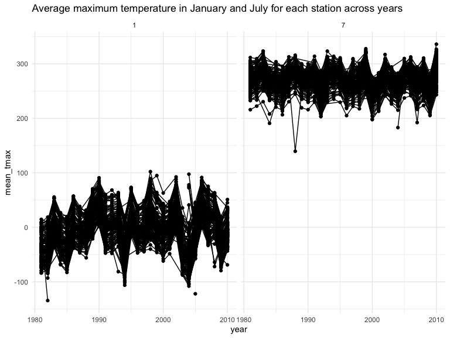
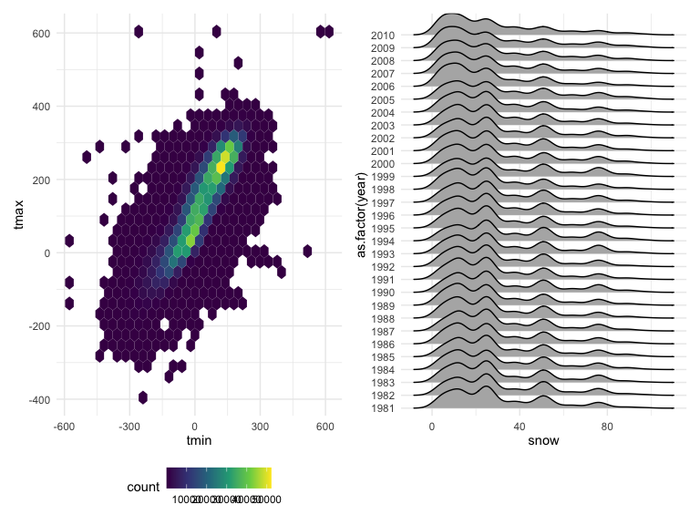
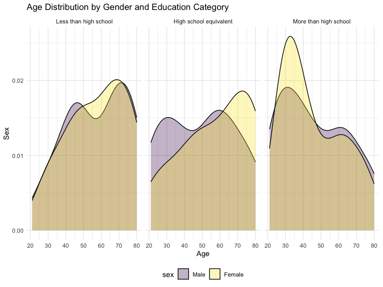
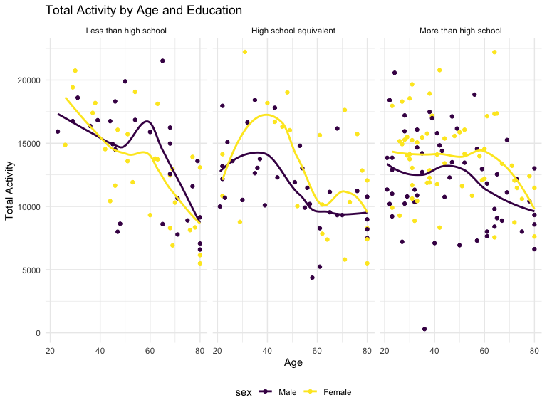
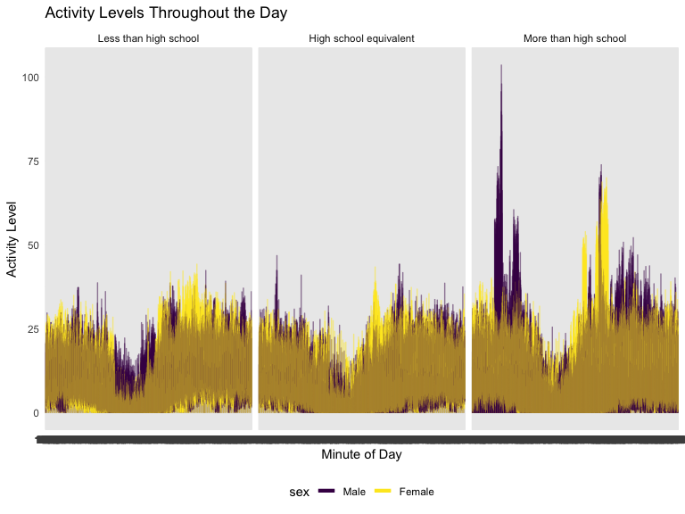
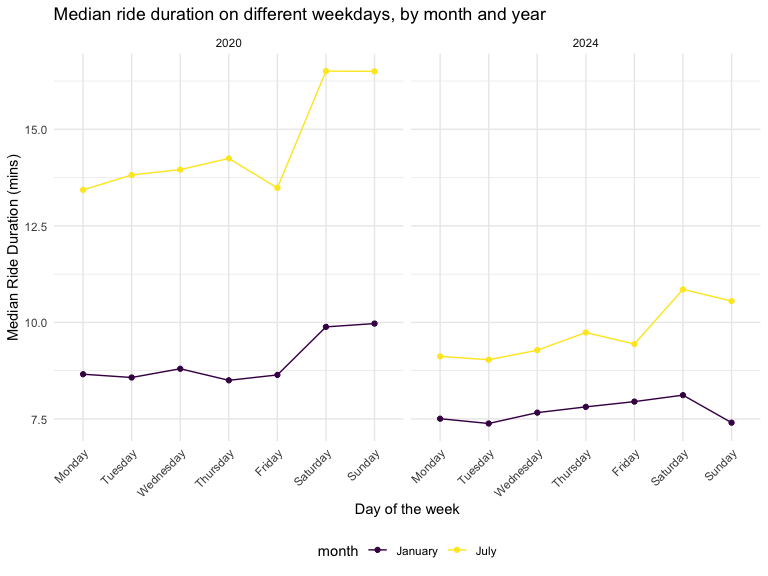
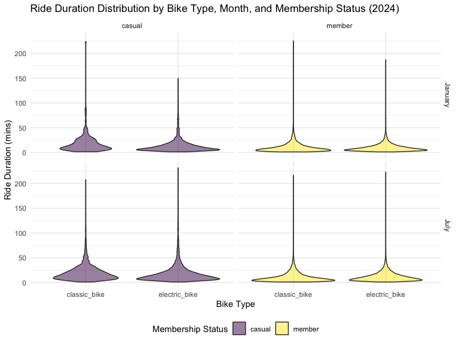

p8105_hw3_ys3766
================
Yifan Shi
2024-10-13

# Problem 1

``` r
data("ny_noaa")
```

This dataset contains a total of 2595176 rows and 7 columns. The dataset
consists of variables on weather station ID, date of observation,
precipitation (tenths of mm), snowfall (mm), snow depth (mm), and
minimum and maximum temperature (tenths of degrees C).

``` r
ny_noaa %>% 
  count(snow) %>% 
  arrange(desc(n))
```

    ## # A tibble: 282 × 2
    ##     snow       n
    ##    <int>   <int>
    ##  1     0 2008508
    ##  2    NA  381221
    ##  3    25   31022
    ##  4    13   23095
    ##  5    51   18274
    ##  6    76   10173
    ##  7     8    9962
    ##  8     5    9748
    ##  9    38    9197
    ## 10     3    8790
    ## # ℹ 272 more rows

``` r
ny_noaa = 
  ny_noaa %>% 
  separate(date, into = c("year", "month", "day"), convert = TRUE) %>% 
  mutate(
    tmax = as.numeric(tmax),
    tmin = as.numeric(tmin)
  )
```

I then cleaned the data by creating separate variables for year, month
and day from the date variable. I also converted the tmin and tmax to
numeric. The most commonly observed snowfall value is 0, because for
most days in year there are no snowfall. It is followed by NA which has
381221 entiries, which indicates that missing values is a concern.

Plot

``` r
ny_noaa %>% 
  group_by(id, year, month) %>% 
  filter (month %in% c(1, 7)) %>% 
  summarize (mean_tmax = mean(tmax, na.rm = TRUE, color = id)) %>% 
  ggplot(aes(x = year, y = mean_tmax, group = id)) + 
  geom_point()+
  geom_path()+
  facet_grid(~month)+
  labs(title = "Average maximum temperature in January and July for each station across years")
```

    ## `summarise()` has grouped output by 'id', 'year'. You can override using the
    ## `.groups` argument.



The above plot shows the average maximum temperature in January and July
in each station across years. The average temperature is high in July
than in January, as the stations are in the Northern Hemisphere. All
stationss are following similar trends of temperature peaks and valleys.
In July 1987, there is one outlier where that station is much colder
than other stations. Similarly in January 1982 and 2005 there are
outliers with much colder temperature.

``` r
hexplot = ny_noaa %>% 
  ggplot(aes(x = tmin, y = tmax))+
  geom_hex(
  )

ridgeplot = ny_noaa %>% 
  filter (snow < 100, snow >0) %>% 
  ggplot(aes(x=snow, y=as.factor(year)))+
  geom_density_ridges()

hexplot + ridgeplot
```

    ## Picking joint bandwidth of 3.76



The above plots show a hex plot of the tmax vs tmin for the full dataset
and a ridge plot of the distribution of snowfall (mm) greater than 0 and
less than 100 by year. The hex plot show that the majority of the data
cluster tightly in the center of the distribution. Some tmax is lower
than the tmin, which should not have happened and might be an error in
data collection. The ridge plot shows multimodal density of snowfall
within a given year. Most stations records 0-35mm of snow in a year, and
another cluster of station see 45mm of snow, and another group see
around 78mm of snow. This is likely due to the conversion from inch to
metric, as 1 inch=25.4mm

# Problem 2

Import, tidy, merge

``` r
demo_df = 
  read_csv("data/nhanes_covar.csv", skip = 4, col_names = TRUE, na = c("NA", ".", "")) %>% 
  janitor::clean_names() %>% 
  mutate(
    sex = factor(sex, levels = c(1, 2), labels = c("Male", "Female")),
    education = factor(education, levels = c(1, 2, 3), labels = c("Less than high school", "High school equivalent", "More than high school"), ordered = TRUE),
    age = as.numeric(age), 
    bmi = as.numeric(bmi)   
  ) 
```

    ## Rows: 250 Columns: 5
    ## ── Column specification ────────────────────────────────────────────────────────
    ## Delimiter: ","
    ## dbl (5): SEQN, sex, age, BMI, education
    ## 
    ## ℹ Use `spec()` to retrieve the full column specification for this data.
    ## ℹ Specify the column types or set `show_col_types = FALSE` to quiet this message.

``` r
accel_df = 
  read_csv("data/nhanes_accel.csv", col_names = TRUE, na = c("NA", ".", "")) %>% 
  janitor::clean_names()
```

    ## Rows: 250 Columns: 1441
    ## ── Column specification ────────────────────────────────────────────────────────
    ## Delimiter: ","
    ## dbl (1441): SEQN, min1, min2, min3, min4, min5, min6, min7, min8, min9, min1...
    ## 
    ## ℹ Use `spec()` to retrieve the full column specification for this data.
    ## ℹ Specify the column types or set `show_col_types = FALSE` to quiet this message.

``` r
nhanes_df = full_join(demo_df, accel_df, by = "seqn") %>% 
  filter(age >= 21, !is.na (sex), !is.na(age), !is.na(bmi), !is.na(education))
```

Table for the number of men and women in each education category

``` r
nhanes_df %>% 
  group_by(education, sex) %>% 
  summarise(
    count = n(), .groups = 'drop'
  ) %>% 
  pivot_wider(
    names_from = sex,
    values_from = count
  ) %>% 
    knitr::kable(
    col.names = c("Education Level", "Male", "Female"),
    caption = "Number of Men and Women by Education Category")
```

| Education Level        | Male | Female |
|:-----------------------|-----:|-------:|
| Less than high school  |   27 |     28 |
| High school equivalent |   35 |     23 |
| More than high school  |   56 |     59 |

Number of Men and Women by Education Category

The table show number of men and women in each education category in
this study sample. There are nearly equal numbers of males (27) and
females (28) have less than high school education. More males (35) than
females (23) are in the high school equivalent category. The highest
education category, more than high school shows a balanced gender
distribution of males (56) and females (59). Among these study
participants, more than high school category has the highest proportion,
followed by high school equivalent then less than high school.

Visualization of the age distributions for men and women in each
education category

``` r
nhanes_df %>% 
  ggplot(aes(x = age, fill = sex))+
  geom_density(alpha = .3)+
  facet_grid(. ~ education)+
  scale_x_continuous(breaks = seq(from = 0, to = 100, by = 10)) +
  labs(
    title = "Age Distribution by Gender and Education Category",
    x = "Age",
    y = "Sex"
  )
```



This density plot provide visualization of age distribution by gender
and education levels. The age distributions are generally centered
around middle age.

For less than high school category, the distribution for females shows a
peak at around 70 years old, and the distribution shows bimodal with a
peak around 70 years old and anohter smaller peak at 45 years old.

For high school equivalent category, the distribution for female shows a
peak at around 75 year old, and the males have slightly younger peaks,
one at 60 and another at 30 years old.

For more than high school, the distribution for both gender are slightly
skewed towards the younger ages, and peaked at around 30 years old, with
another smaller peak at 60 years old.

Total activity level

``` r
nhanes_df <- nhanes_df %>%
  mutate(
  total_activity = rowSums(select(., starts_with("min")), na.rm = TRUE)) %>% 
  relocate(seqn, sex, age, bmi, education, total_activity) 
  
  
nhanes_df %>% 
  ggplot(aes(x = age, y = total_activity, color = sex ))+
  geom_point()+
  geom_smooth(se = FALSE)+
  facet_grid(.~ education)+
  labs(title = "Total Activity by Age , Sex and Education",
       x = "Age", 
       y = "Total Activity")
```

    ## `geom_smooth()` using method = 'loess' and formula = 'y ~ x'



This scatter plot with a smooth line shows the total activity level by
sex and education levels. We observe general trend of decline in total
activity with increasing age across all education levels.

For the less than high school group, the activity levels declines very
sharply with age. Females have higher activity levels than males before
age 40 where the cross-over occur. Males’ activity level is greater than
female after age 40.

For high school equivalent, the total activity shows increasing trend
from younger age until 40, and gradually decline for both males and
females. Females have higher total activity at all ages except early
20s.

For more than high school, the decline in total activity with age is
less pronounced compared to other groups. Females have higher total
activity than males at all ages.

24-hour activity

``` r
nhanes_df_long <-  nhanes_df %>% 
  pivot_longer(
    cols = min1:min1440,
    names_to = "minute",
    names_prefix = "min",
    values_to = "activity_level"
  ) %>% 
  mutate(
    minute = as.numeric(minute)
  )
  
nhanes_df_long %>%   
  ggplot(aes(x = minute, y = activity_level, color = sex)) +
  geom_line(alpha=.3)+
  geom_smooth(aes(group = sex), se = FALSE, size = .5)+
  scale_x_continuous(breaks = seq(from = 0, to = 1440, by = 120)) +
  facet_grid(.~ education)+
  labs(
    title = "Activity Levels Throughout the Day",
    x = "Minute of Day",
    y = "Activity Level"
  )+
  theme(
    axis.text.x = element_text(angle = 45, hjust = 1),  
    legend.position = "bottom"  
  )
```

    ## `geom_smooth()` using method = 'gam' and formula = 'y ~ s(x, bs = "cs")'



The above graph shows that the activity levels throughout the day for
different education category by gender. For all education groups, the
activity level first decrease from 0-240 minutes, then increased, and
the activity level is higher during the mid-day, and gradually decline
towards the end of the day. For less than high school, males and females
have similar levels of activity level throughout the day. For high
school equivalent and more than high school, males have higher activity
level at the first 240 mins and last 60 min of the day, and for the rest
of the day females have hgher activity level. More than high school have
slightly higher activity level than the rest two groups, and more
spikes.

# Problem 3

Load, tidy and combine the datasets

``` r
jan2020_df = 
  read_csv("data/Jan 2020 Citi.csv",col_names = TRUE, na = c("NA", ".", "")) %>% 
  janitor::clean_names() %>% 
  mutate(
    year = "2020",
    month = "January"
  )
```

    ## Rows: 12420 Columns: 7
    ## ── Column specification ────────────────────────────────────────────────────────
    ## Delimiter: ","
    ## chr (6): ride_id, rideable_type, weekdays, start_station_name, end_station_n...
    ## dbl (1): duration
    ## 
    ## ℹ Use `spec()` to retrieve the full column specification for this data.
    ## ℹ Specify the column types or set `show_col_types = FALSE` to quiet this message.

``` r
july2020_df = 
  read_csv("data/July 2020 Citi.csv",col_names = TRUE, na = c("NA", ".", "")) %>% 
  janitor::clean_names()%>% 
  mutate(
    year = "2020",
    month = "July"
  )
```

    ## Rows: 21048 Columns: 7
    ## ── Column specification ────────────────────────────────────────────────────────
    ## Delimiter: ","
    ## chr (6): ride_id, rideable_type, weekdays, start_station_name, end_station_n...
    ## dbl (1): duration
    ## 
    ## ℹ Use `spec()` to retrieve the full column specification for this data.
    ## ℹ Specify the column types or set `show_col_types = FALSE` to quiet this message.

``` r
jan2024_df = 
  read_csv("data/Jan 2024 Citi.csv",col_names = TRUE, na = c("NA", ".", "")) %>% 
  janitor::clean_names()%>% 
  mutate(
    year = "2024",
    month = "January"
  )
```

    ## Rows: 18861 Columns: 7
    ## ── Column specification ────────────────────────────────────────────────────────
    ## Delimiter: ","
    ## chr (6): ride_id, rideable_type, weekdays, start_station_name, end_station_n...
    ## dbl (1): duration
    ## 
    ## ℹ Use `spec()` to retrieve the full column specification for this data.
    ## ℹ Specify the column types or set `show_col_types = FALSE` to quiet this message.

``` r
july2024_df = 
  read_csv("data/July 2024 Citi.csv",col_names = TRUE, na = c("NA", ".", "")) %>% 
  janitor::clean_names()%>% 
  mutate(
    year = "2024",
    month = "July"
  )
```

    ## Rows: 47156 Columns: 7
    ## ── Column specification ────────────────────────────────────────────────────────
    ## Delimiter: ","
    ## chr (6): ride_id, rideable_type, weekdays, start_station_name, end_station_n...
    ## dbl (1): duration
    ## 
    ## ℹ Use `spec()` to retrieve the full column specification for this data.
    ## ℹ Specify the column types or set `show_col_types = FALSE` to quiet this message.

``` r
citibike = bind_rows(jan2020_df, july2020_df, jan2024_df, july2024_df)
```

This dataset contains a total of 99485 rows and 9 columns. The dataset
consists of variables on ride id, rideable type, weekdays, duration,
start station and end station, member type, for each of four month,
i.e. Janunary and July in 2020 and 2024.

Table for total number of rides in each combination of year and month,
separating casual riders and members

``` r
citibike %>% 
  group_by(year, month, member_casual) %>% 
  summarise(total_rides = n(), .groups = 'drop') %>% 
  pivot_wider(names_from = member_casual, values_from = total_rides) %>%  
    knitr::kable(col.names = c("Year", "Month", "Casual", "Member")
    )
```

| Year | Month   | Casual | Member |
|:-----|:--------|-------:|-------:|
| 2020 | January |    984 |  11436 |
| 2020 | July    |   5637 |  15411 |
| 2024 | January |   2108 |  16753 |
| 2024 | July    |  10894 |  36262 |

For all 4 months, members have more rides than casual. July sees more
rides than January in both 2020 and 2024. The number of rides increased
from 2020 to 2024, for both member types and both months.

Table for the 5 most popular starting stations for July 2024, with
number of rides oroginating from these stations

``` r
citibike %>% 
  filter(year == 2024, month == "July") %>% 
  count(start_station_name) %>% 
  top_n(5) %>% 
  knitr::kable(
  col.names = c("Start Station Name", "Number of Rides"))
```

    ## Selecting by n

| Start Station Name       | Number of Rides |
|:-------------------------|----------------:|
| Pier 61 at Chelsea Piers |             163 |
| University Pl & E 14 St  |             155 |
| W 21 St & 6 Ave          |             152 |
| W 31 St & 7 Ave          |             146 |
| West St & Chambers St    |             150 |

The top 5 most popular starting stations for July 2024 are Pier 61 at
Chelsea Piers (163), University Pl & E 14 St (155), W 21 St & 6 Ave
(152), W 31 St & 7 Ave (146), and West St & Chambers St (150)

Plot to investigate effects of day of the week, month, and year on
median ride duration

``` r
citibike %>%
  group_by(weekdays, month, year) %>% 
  summarise(
    median_duration = median(duration), na.rm = TRUE, .groups = 'drop'
  ) %>% 
  mutate(
    weekdays = factor(weekdays, 
                      levels =  c("Monday", "Tuesday", "Wednesday", "Thursday", "Friday", "Saturday", "Sunday"))) %>% 
  ggplot(aes(x = weekdays, y = median_duration, group = interaction(month, year), color = month))+
  geom_point()+
  geom_line(aes())+
  facet_grid(.~year)+
  labs(
    title = "Median ride duration on different weekdays, by month and year",
    x = "Day of the week",
    y = "Median Ride Duration (mins)"
  )+theme(
    axis.text.x = element_text(angle = 45, hjust = 1),  
    legend.position = "bottom"  
  )
```



The above graph shows the median ride duration on different weekdays, by
month and year.

Weekends see higher median ride duration than weekdays in January, July
of 2020, and July of 2024. The difference between weekends and weekdays
are more pronoun in 2020 than in 2024. In July in both 2020 and 2024,
Fridays see the shortest median ride duration. Saturdays have the
longest median ride duration in all month, except January 2020 where
Sunday have slightly higher median duration than Saturday.

In both 2024 and 2020, median ride duration in July are consitently
higher than in January, possibly due to more favorable weather
conditions.

Median ride duration are longer in 2020 than 2024 for both January and
July.

Impact of month, membership status, bike type on the distribution of
ride duration

``` r
citibike %>% 
  filter(year == 2024) %>% 
  ggplot(aes(x = rideable_type, y = duration, fill = member_casual))+
  geom_violin(alpha = .5)+
  facet_grid(month~member_casual)+
  labs(
    title = "Ride Duration Distribution by Bike Type, Month, and Membership Status (2024)",
    x = "Bike Type",
    y = "Ride Duration (mins)",
    fill = "Membership Status"
  )
```



The above violin plots show the distribution of ride duration by month,
membership status and bike type in 2024.

Most of the rides are within an hour, with outliers extending into 3/4
hours. The modes for all plots are at shorter ride duration, about 10
minutes.

Members tend to have shorter ride duration and narrower distribution
compared to casual riders, regardless of bike types and month.

Distribution for electric bikes tend to be more concentrated at shorter
ride duration compared to classic bikes, possibly due to ease of riding
that lead to quicker trip. Classic bikes shows wider distribution of
ride duration, especially among casual riders, indicating the
variability in how they are used.

Seasonally, the distribution does not change significantly between
January and July for members. There appears to be a slight increase in
the duration of rides for casual riders in July, possibly due to more
favourable weather conditions encouraging longer rides.
