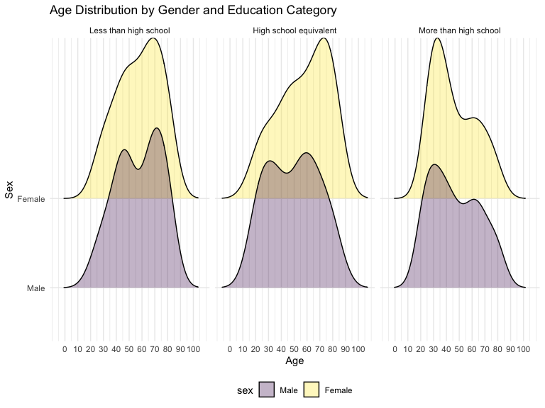
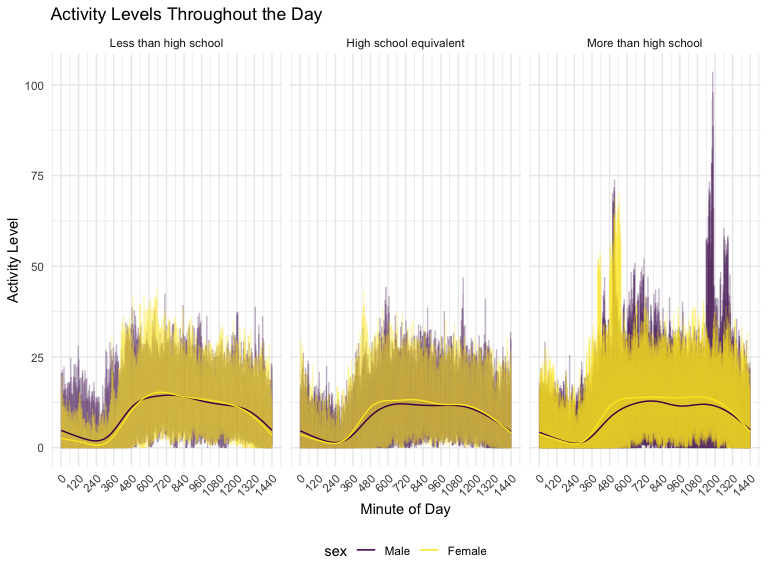

p8105_hw3_ys3766
================
Yifan Shi
2024-10-13

Problem 1

``` r
data("ny_noaa")
```

This dataset contains a total of ‘r nrow(ny_noaa)’ rows and ‘r
ncol(ny_noaa)’ columns. The dataset consists of variables on weather
station ID, date of observation, precipitation (tenths of mm), snowfall
(mm), snow depth (mm), and minimum and maximum temperature (tenths of
degrees C).

``` r
ny_noaa %>% 
  count(snow) %>% 
  arrange(desc(n))
```

    ## # A tibble: 282 × 2
    ##     snow       n
    ##    <int>   <int>
    ##  1     0 2008508
    ##  2    NA  381221
    ##  3    25   31022
    ##  4    13   23095
    ##  5    51   18274
    ##  6    76   10173
    ##  7     8    9962
    ##  8     5    9748
    ##  9    38    9197
    ## 10     3    8790
    ## # ℹ 272 more rows

``` r
ny_noaa = 
  ny_noaa %>% 
  separate(date, into = c("year", "month", "day"), convert = TRUE) %>% 
  mutate(
    tmax = as.numeric(tmax),
    tmin = as.numeric(tmin)
  )
```

I then cleaned the data by creating separate variables for year, month
and day from the date variable. I also converted the tmin and tmax to
numeric. The most commonly observed snowfall value is 0, because for
most days in year there are no snowfall. It is followed by NA which has
381221 entiries, which indicates that missing values is a concern.

Plot

``` r
ny_noaa %>% 
  group_by(id, year, month) %>% 
  filter (month %in% c(1, 7)) %>% 
  summarize (mean_tmax = mean(tmax, na.rm = TRUE, color = id)) %>% 
  ggplot(aes(x = year, y = mean_tmax, group = id)) + 
  geom_point()+
  geom_path()+
  facet_grid(~month)+
  labs(title = "Average maximum temperature in January and July for each station across years")
```

    ## `summarise()` has grouped output by 'id', 'year'. You can override using the
    ## `.groups` argument.


The above plot shows the average maximum temperature in January and July
in each station across years. The average temperature is high in July
than in January, as the stations are in the Northern Hemisphere. All
stationss are following similar trends of temperature peaks and valleys.
In July 1987, there is one outlier where that station is much colder
than other stations. Similarly in January 1982 and 2005 there are
outliers with much colder temperature.

``` r
hexplot = ny_noaa %>% 
  ggplot(aes(x = tmin, y = tmax))+
  geom_hex(
  )

ridgeplot = ny_noaa %>% 
  filter (snow < 100, snow >0) %>% 
  ggplot(aes(x=snow, y=as.factor(year)))+
  geom_density_ridges()

hexplot + ridgeplot
```

    ## Picking joint bandwidth of 3.76


The above plots show a hex plot of the tmax vs tmin for the full dataset
and a ridge plot of the distribution of snowfall (mm) greater than 0 and
less than 100 by year. The hex plot show that the majority of the data
cluster tightly in the center of the distribution. Some tmax is lower
than the tmin, which should not have happened and might be an error in
data collection. The ridge plot shows multimodal density of snowfall
within a given year. Most stations records 0-35mm of snow in a year, and
another cluster of station see 45mm of snow, and another group see
around 78mm of snow. This is likely due to the conversion from inch to
metric, as 1 inch=25.4mm

Problem 2 Import, tidy, merge

``` r
demo_df = 
  read_csv("data/nhanes_covar.csv", skip = 4, col_names = TRUE, na = c("NA", ".", "")) %>% 
  janitor::clean_names() %>% 
  mutate(
    sex = factor(sex, levels = c(1, 2), labels = c("Male", "Female")),
    education = factor(education, levels = c(1, 2, 3), labels = c("Less than high school", "High school equivalent", "More than high school"), ordered = TRUE),
    age = as.numeric(age), 
    bmi = as.numeric(bmi)   
  ) 
```

    ## Rows: 250 Columns: 5
    ## ── Column specification ────────────────────────────────────────────────────────
    ## Delimiter: ","
    ## dbl (5): SEQN, sex, age, BMI, education
    ## 
    ## ℹ Use `spec()` to retrieve the full column specification for this data.
    ## ℹ Specify the column types or set `show_col_types = FALSE` to quiet this message.

``` r
accel_df = 
  read_csv("data/nhanes_accel.csv", col_names = TRUE, na = c("NA", ".", "")) %>% 
  janitor::clean_names()
```

    ## Rows: 250 Columns: 1441
    ## ── Column specification ────────────────────────────────────────────────────────
    ## Delimiter: ","
    ## dbl (1441): SEQN, min1, min2, min3, min4, min5, min6, min7, min8, min9, min1...
    ## 
    ## ℹ Use `spec()` to retrieve the full column specification for this data.
    ## ℹ Specify the column types or set `show_col_types = FALSE` to quiet this message.

``` r
nhanes_df = full_join(demo_df, accel_df, by = "seqn") %>% 
  filter(age >= 21, !is.na (sex), !is.na(age), !is.na(bmi), !is.na(education))
```

Table for the number of men and women in each education category

``` r
nhanes_df %>% 
  group_by(education, sex) %>% 
  summarise(
    count = n(), .groups = 'drop'
  ) %>% 
  pivot_wider(
    names_from = sex,
    values_from = count
  ) %>% 
    knitr::kable(
    col.names = c("Education Level", "Male", "Female"),
    caption = "Number of Men and Women by Education Category")
```

| Education Level        | Male | Female |
|:-----------------------|-----:|-------:|
| Less than high school  |   27 |     28 |
| High school equivalent |   35 |     23 |
| More than high school  |   56 |     59 |

Number of Men and Women by Education Category

The table show number of men and women in each education category in
this study sample. There are nearly equal numbers of males (27) and
females (28) have less than high school education. More males (35) than
females (23) are in the high school equivalent category. The highest
education category, more than high school shows a balanced gender
distribution of males (56) and females (59). Among these study
participants, more than high school category has the highest proportion,
followed by high school equivalent then less than high school.

Visualization of the age distributions for men and women in each
education category

``` r
nhanes_df %>% 
  ggplot(aes(x = age, fill = sex))+
  geom_histogram(binwidth = 10)+
  labs(
    title = "Age Distribution by Gender and Education Category",
    x = "Age",
    y = "Count"
  )+
  facet_grid(. ~ education)
```


``` r
nhanes_df %>% 
  ggplot(aes(x = age, y = sex, fill = sex))+
  geom_density_ridges(alpha = .3)+
  facet_grid(. ~ education)+
  scale_x_continuous(breaks = seq(from = 0, to = 100, by = 10)) +
  labs(
    title = "Age Distribution by Gender and Education Category",
    x = "Age",
    y = "Sex"
  )
```

    ## Picking joint bandwidth of 7.91

    ## Picking joint bandwidth of 9.03

    ## Picking joint bandwidth of 7.15


This histogram and the density ridge plot provide visualization of age
distribution by gender and education levels. The age distributions are
generally centered around middle age.

For less than high school category, the distribution for females shows a
peak at around 70 years old, and the distribution shows bimodal with a
peak around 70 years old and anohter smaller peak at 45 years old.

For high school equivalent category, the distribution for female shows a
peak at around 75 year old, and the males have slightly younger peaks,
one at 60 and another at 30 years old.

For more than high school, the distribution for both gender are slightly
skewed towards the younger ages, and peaked at around 30 years old, with
another smaller peak at 60 years old.

Total activity level

``` r
nhanes_df <- nhanes_df %>%
  mutate(
  total_activity = rowSums(select(., starts_with("min")), na.rm = TRUE)) %>% 
  relocate(seqn, sex, age, bmi, education, total_activity) 
  
  
nhanes_df %>% 
  ggplot(aes(x = age, y = total_activity, color = sex ))+
  geom_point()+
  geom_smooth(se = FALSE)+
  facet_grid(.~ education)+
  labs(title = "Total Activity by Age and Education",
       x = "Age", 
       y = "Total Activity")
```

    ## `geom_smooth()` using method = 'loess' and formula = 'y ~ x'


This scatter plot with a smooth line shows the total activity level by
sex and education levels. We observe general trend of decline in total
activity with increasing age across all education levels.

For the less than high school group, the activity levels declines very
sharply with age. Females have higher activity levels than males before
age 40 where the cross-over occur. Males’ activity level is greater than
female after age 40.

For high school equivalent, the total activity shows increasing trend
from younger age until 40, and gradually decline for both males and
females. Females have higher total activity at all ages except early
20s.

For more than high school, the decline in total activity with age is
less pronounced compared to other groups. Females have higher total
activity than males at all ages.

24-hour activity

``` r
nhanes_df_long <-  nhanes_df %>% 
  pivot_longer(
    cols = min1:min1440,
    names_to = "minute",
    names_prefix = "min",
    values_to = "activity_level"
  )
  
nhanes_df_long %>%   
  ggplot(aes(x = minute, y = activity_level, color = sex)) +
  geom_line(alpha=.5)+
  geom_smooth(
    se = FALSE, size = 1.5 )+
  facet_grid(.~ education)+
  labs(
    title = "Activity Levels Throughout the Day",
    x = "Minute of Day",
    y = "Activity Level"
  )
```

    ## `geom_smooth()` using method = 'loess' and formula = 'y ~ x'



Probelm 3
